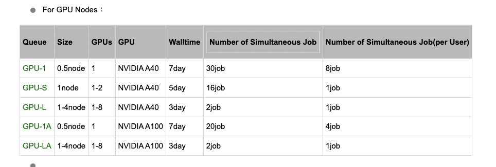

### Connect to general server.
- Remote by commanline (terminal): `ssh <account_id>@<server_host_or_ip>`,
e.g. `ssh s2010235@spcc.jaist.ac.jp`

### Jaist server information.
- _Jaist server contains many kind of servers, server large memory (`lmpcc`), server containing GPU (e.g. `spcc`) etc (more infor about servers in [here](https://www.jaist.ac.jp/iscenter/en/mpc/))._
    >**Note**: all jaist server only connect via internal (LAN) network such as JAISTALL or JAIST wifi. If your computer use 3G internet or go outside JAIST campus, you need to use [VPN](https://www.jaist.ac.jp/iscenter/en/remote-access/ssl-vpn/) to connect to JAIST server. 

- _Each kind of server (e.g. `spcc`), there are 2 different nodes  (more infor in [here](https://www.jaist.ac.jp/iscenter/en/mpc/manual/0/0-2/)):_
    - **Login node:** the node alway run, and accept the connection any time. However, this node doesnt have the GPU, and contains low resource. This node is not accepted to run any job or experiments. Any process run with long time (or use too much CPU usage) will be reported via your email by Jaist monitor process for killing it. (e.g.  login to this node by `ssh s2010235@spcc.jaist.ac.jp`, host name of server which you see on the terminal is `kagayaki`)
        - `screen` - a program manage background terminal on linux (it can be used on both local computer (can be installed by `brew install screen`) and server (recommended)). We need this program to keep connection with the computation server in interactive mode. Remember that, when we submit a request to get a new computation server, Jaist will give us a server in one week (or three days up to the Queue - see more in collum Walltime bellow figure  or [here](https://www.jaist.ac.jp/iscenter/en/mpc/kagayaki/2/)) but we need to **keep connection** with that computation server. If we can't keep connection, Jaist will take back immediately computation server. => `screen` is the background terminal, that can keep connection to Computation server. 
        
            - See more in [here](https://www.geeksforgeeks.org/screen-command-in-linux-with-examples/)
            - `screen` is organized by sessions, each sessions contain many terminals. 
            - The important commands:
                ><span style="color:red">**Practice:**</span> 
                - Create new session:  `screen -S test_session` => this command will create a new session named `test_session`. If you run this command 2 times, linux system will create 2 sessions having the same name and attach name with session id beside for reparating. 
                    > **Note:** when you run this command, your terminal will **immediately** jump to terminal of `screen` program. Check Detach command bellow to detach and back to the original terminal. 
                - Detach out of session without kill it:  press  sequencely `Ctrl-a` then  `d`.
                - Show all the current sessions: `screen -ls`. If there is no session in your system, output is
                    ```
                    No Sockets found in /var/folders/../T/.screen.
                    ```
                    or exist a session: 
                    ```
                    There is a screen on:
                            45845.test_session      (Attached)
                    1 Socket in /var.../.screen.
                    ```

                - Attach to special session via session name from remote terminal: `screen -dr <session_name>`, e.g. `screen -dr test_session`
                - Other important hotkeys:
                    ```
                    Ctrl-a + c: It create a new windows in current session.
                    Ctrl-a + w: It display the list of all the windows currently run.
                    Ctrl-a + n: It go to the next windows.
                    Ctrl-a + p: It go to the previous windows.
                    Ctrl-a + k: It close the current windows (kill).
                    Ctrl-a + d: It detach a screen session without stopping it.
                    Ctrl-d: Exit current window. If current session only contains 1 window, this hotkeys also kill this session.
                    Ctrl-a + [: It start the copy mode. This mode can roll mouse up or down
                    ```
                ><span style="color:red">**Exercise:**</span> <br/>
                    - Remote to login node server `spcc`. <br/>
                    - Create a `screen` session named `test_count`. <br/>
                    - Go to the folder of this tutorial and run python program by `python count_sleep.py`. <br/>
                    - Then create a second window of this `test_count` session. <br/>
                    - Run python program `python count_sleep.py` in the second window. <br/>
                    - Detach out of `test_count` session. <br/>
                    - Log out server by comand `exit` to comeback your local terminal and wait 5 seconds. <br/>
                    - Remote again to server and attach to `test_count` session to check the ouput of both two windows. <br/>
                    

    - **Computation nodes:** this node require register (by using `qsub` program) to get the access permission. 
        - `qsub` (**q**ueue **sub**mit) - this is linux program in server support register permission to use resource, only can test this program on the JAIST server. You can try it on the Login node. 
            - **require a computing server:**  by `qsub -q GPU-1 -I` :  with the computation queue (`-q GPU-1`) in interactive mode (`-I`) - mode allowing type and run new commands as a remote process. All difference queues and related GPU can found in bellow image or [here](https://www.jaist.ac.jp/iscenter/en/mpc/kagayaki/2/).
            
                > **Note:** Normally, you should run this command in a `screen` program of the Login node. Because when Jaist provide you a computing server (e.g. `spcc-186`), you need to keep connection with that server to have permission access to that server in some days next until your job finish. 

                _For example:_ We run `qsub -q SINGLE -I`  to require a computing server in queue `SINGLE`. Output is: 
                ```bash
                [s1920413@kagayaki ~ ] qsub -q SINGLE -I # this is terminal of Login node, so the host name is `kagayaki`
                qsub: waiting for job 5594416.spcc-adm1 to start
                qsub: job 5594416.spcc-adm1 ready

                [s1920413@spcc-186 ~ ] # this is terminal of Computation node,  host name is `spcc-186`
                ```
            -  **release a computing server**. <span style="color:red">Pls check the `qstat` command before release your resource computing server</span> . When you finish use your computing server, you can release that computing server by command `exit` or press `Ctrl-D`.
        -  `qstat` - this is linux program to show your required resource statistic information. Try this command `qstat -a`, it will show many job and student id related to that job, and the related queue they request. To check only your submission job, try   `qstat -a | grep $user` where `| grep` is a filter program, `$user` is your user name. This is an output example: 
            ```
            [s1920413@spcc-186 ~ ] qstat -a | grep $user 
            5594399.spcc-adm1    s1920413 GPU-1    STDIN         --    1  26  245gb 168:0 Q    -- 
            5594416.spcc-adm1    s1920413 SINGLE   STDIN      39584*   1  64  245gb 168:0 R 00:16
            ```
            Take a look on the second row, you will see job id is `5594416`, my user id is `s1920413`, node `SINGLE`, wall time is `168` hours (around 7 days), used time is `00` hour, `16` minutes.


     
    ><span style="color:red">**Exercise:**</span> <br/>
        - Copy `count_sleep.py` to login server.<br/>
        - Login to Login server, request a conputing server in the `LONG` queue using `screen`. Remember (note to your paper) the computing server host name JAIST give you. (e.g. `spcc-186`) <br/>
        - Detach out of your  `screen`.  <br/>
        - Restart your local computer. <br/>
        - Login to your computing server by `ssh <user_id>@<computing_server>` from your local terminal. <br/>
        - Run this command `python count_sleep.py`<br/>
        - Kill it by `Ctrl-C` when it count over 10 seconds.<br/>
        - Attach to your `screen` on the login node to release your coputing server.
        