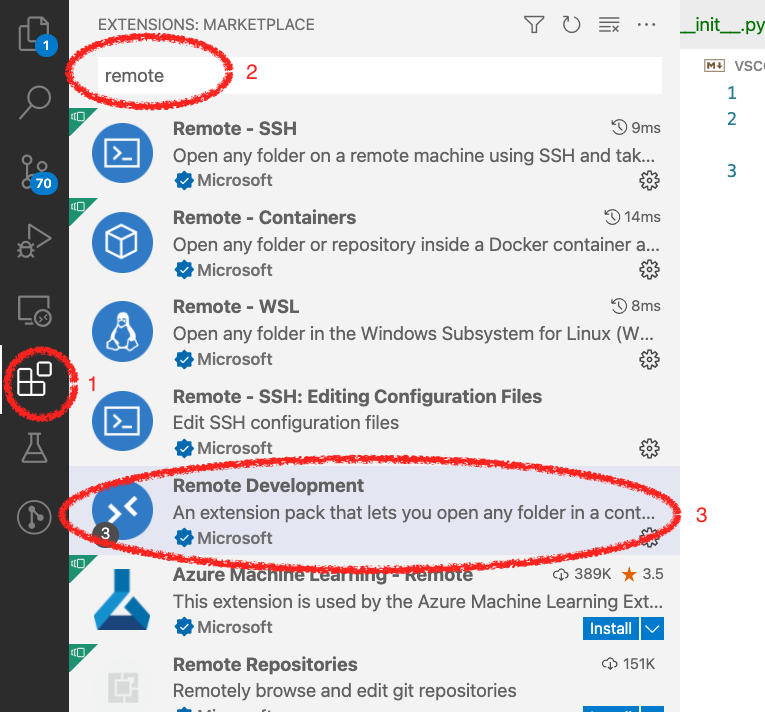
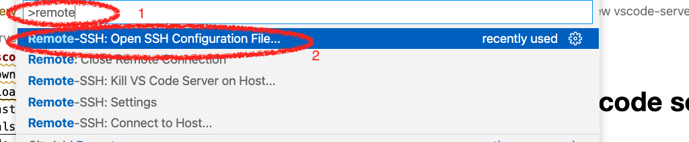
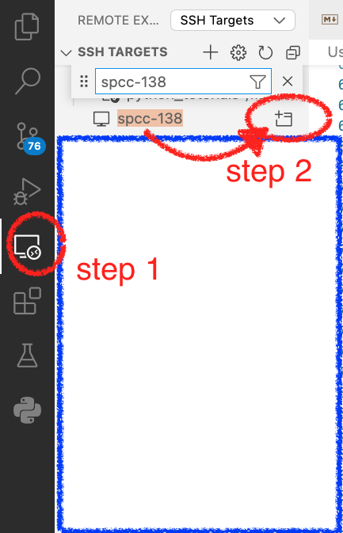
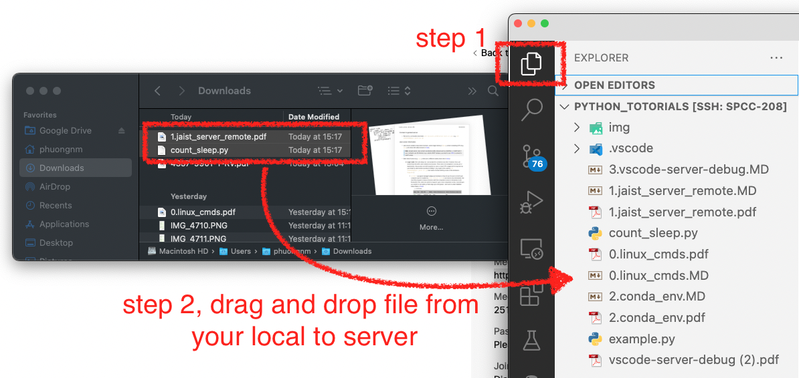
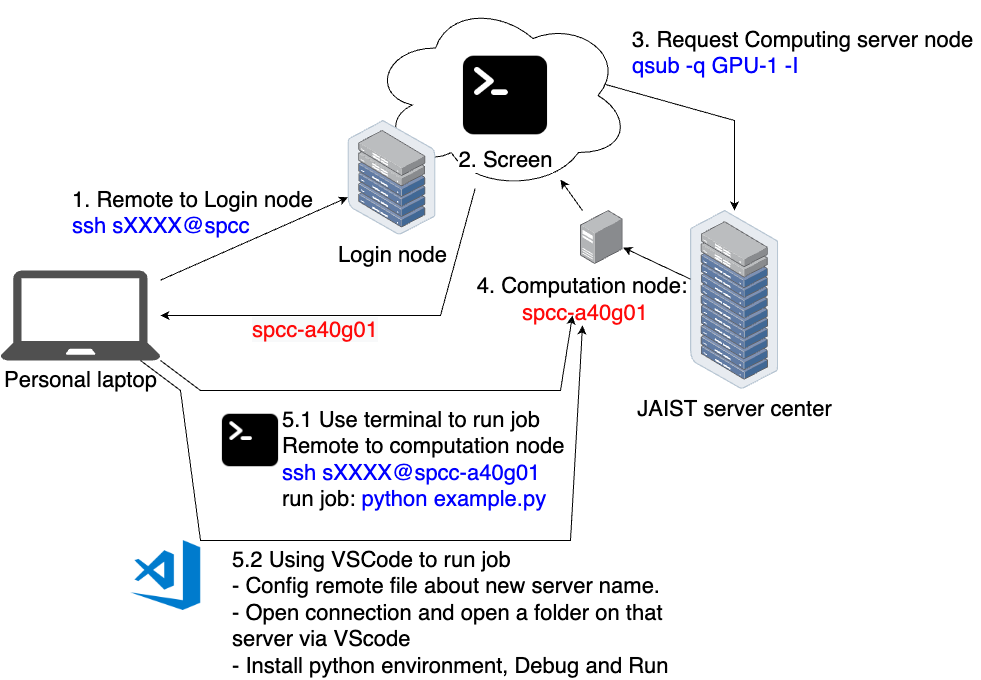

## Vscode server remote debug
*created by PhuongNM*
****

### 1. Install step  (skip it because if you already install it)
1. Down and install vscode [link](https://code.visualstudio.com/download)
2. Install - Remote Development [link](https://marketplace.visualstudio.com/items?itemName=ms-vscode-remote.vscode-remote-extensionpack) 
   >Note: it will automatically install `Remote - SSH` plugins. If not, you should install `Remote - SSH` 

### 2. Request to Jaist computing server. 
1. Login to the login node via `ssh s2010235@spcc`
2. Open a new screen session `screen -S test_vscode`
3. Request a computing server `qsub -q SINGLE -I`
4. Note the computing server host id (e.g. `spcc-138`). 
5. Detach out of screen (`Ctrl-A + d`).

### 3. Remote Server Configs 

1. Open SSH remote config file (path: `~/.ssh/config` in your local computer, similar to document `0.linux_cmds.pdf` ):

    You can use `Ctrl + P` (or `Command + P` in MacOS) and type `>remote` and select `Remote-SSH: Open SSH Configuration File...` 
    > Note: this file save information of your remote servers. See more the format of this file in [here](https://man7.org/linux/man-pages/man5/ssh_config.5.html)


2. Fill to this file the server information and saved if **the server information have not exist in your file**:
   ```
    Host remote_host_name_
        HostName remote_host_name_address 
    ```
    examples: 
    ```yaml
    Host spcc-138
        HostName spcc-138
    ```  

### 3. Open Computing Server in VScode 
1. Open **remote folder** on the computing server. Follow this image, it will pop up a new vscode window. You need to type password. => Click to `Open Folder` in that pop up vscode window to open your folder in the computing server. 
    


2. Copy all your python files to that folder by drag and drop. 
   

2. Try to run and debug it on VScode (document about python debug in [here](https://code.visualstudio.com/docs/python/debugging)).  

### 4. Overview whole process and Exercise
 
><span style="color:red">**Exercise:**</span> <br/>
Try to run and debug file `example.py` which I sent you before on JAIST computing server following above steps.  
**Note**: Install new environment named `env_python_tour` using python 3.6 on JAIST server and install all the packages which are used in  file `example.py`.

    