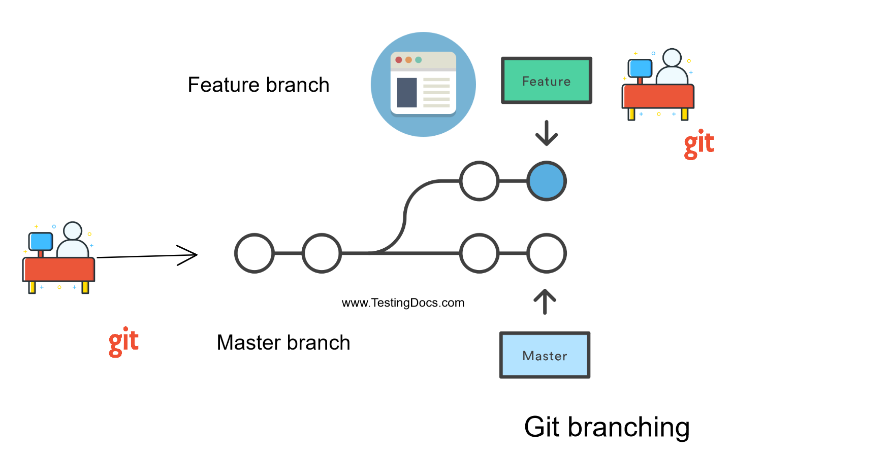
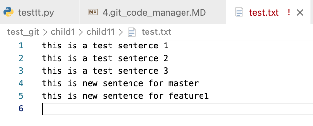
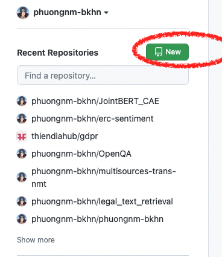
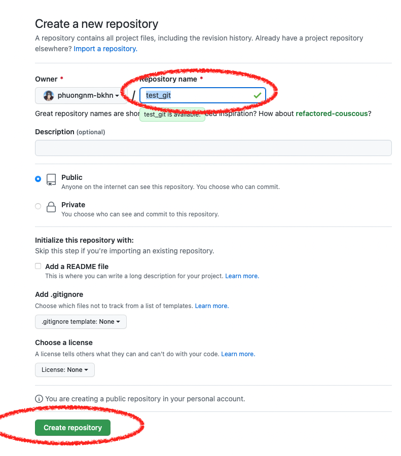
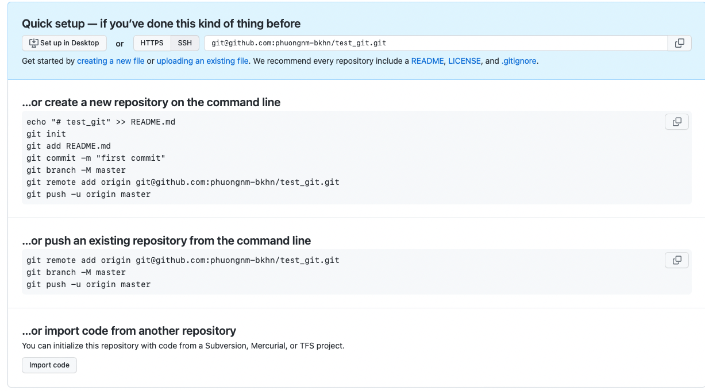
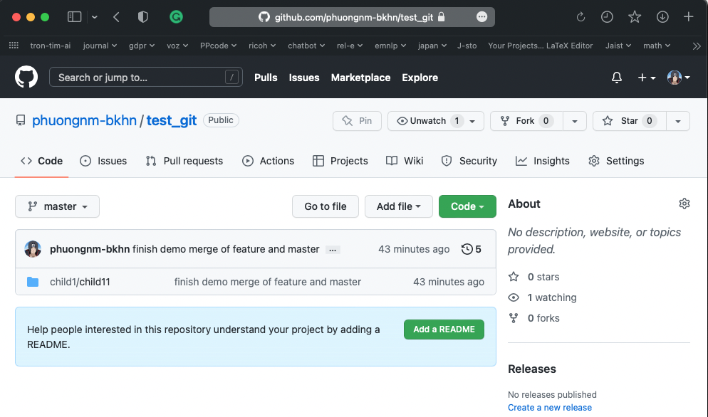

### Code management - git - github / gitlab
- `git`: is the linux program for code management. This program logs the modification in your code: which line is added, deleted, or replaced in each checkpoint. This program also so useful for code team working. 
    - check git program installed or not:  `git help` 
        - if it is not installed, run on MacOS: `brew install git`, Linux `apt install git`.
- how `git` work?: 
    - this program is installed for monitoring a folder (e.g. folder `test_git/` in bellow block) and logging every change in that folder and its children's folders.  For example, if you install `git` monitor in the folder `test_git/`, all the changes in file `hihi.txt` also can be tracked by `git` program. 
        ```
        test_git/
        ├── child1
        │   └── child11
        │       └── hihi.txt
        └── child2
        ```
    - this program will save all the data/code information and the changing actions (metadata)  in a hidden folder named `.git/`. For example:
    
        ``` 
        test_git/
            ├── .git  # THIS FOLDER SAVE ALL DATA of git program.
            │   ├── HEAD
            │   ├── branches
            │   ├── config
            │   ├── description
            │   ├── ...
            │   └── refs
            │       ├── heads
            │       └── tags
            ├── child1
            │   └── child11
            │       └── hihi.txt
            └── child2
        ```
- **Practice**: 
    - install git into a special folder and do a simple commits. 
        - Create a new folder and go to this folder: `mkdir test_git && cd test_git`
        - install git in this folder `git init` 
            ```
            [s1920413@spcc-005 ~/test_git ] git init
            Initialized empty Git repository in /home/.../test_git/.git/
            ```
        - Check the current status, is there any files change: `git status`. Because there is no change in this folder => `git` shows the bellow message  
            ```
            On branch master
            No commits yet
            nothing to commit (create/copy files and use "git add" to track)
            ```
        - Add a new file into `child1/child11` folder: 
            - `mkdir -p child1/child11/` # create a folder 
            - `echo "this is a test sentence 1" > child1/child11/test.txt`
            The `git` program found a new change and notify a message about this change, _"nothing added to commit but untracked files present (use "git add" to track)"_
                ```
                On branch master
                No commits yet
                Untracked files:
                (use "git add <file>..." to include in what will be committed)
                        child1/

                nothing added to commit but untracked files present (use "git add" to track)
                ```
            - `git add child1` # this command will add the `child1` folder into tracking list and monitor all the change of this folder.
            - `git status` # show the current status 
                ``` 
                    new file:   child1/child11/test.txt # this line notify about the new file is added
                ```
            - `echo "this is a test sentence 2" >> child1/child11/test.txt` # add a new line into the file test.txt
            - `git status` # show the current status. The output shown that, the file test is new file and it contains some change inside 
                ```
                Changes to be committed:
                (use "git rm --cached <file>..." to unstage)
                        new file:   child1/child11/test.txt

                Changes not staged for commit:
                (use "git add <file>..." to update what will be committed)
                (use "git restore <file>..." to discard changes in working directory)
                        modified:   child1/child11/test.txt
                ```
            
            - To check the detail change, we use `git diff`. The output show the line 2 is added. 
                ```
                diff --git a/child1/child11/test.txt b/child1/child11/test.txt
                index 16e8d15..2010cad 100644
                --- a/child1/child11/test.txt
                +++ b/child1/child11/test.txt
                @@ -1 +1,2 @@
                this is a test sentence 1
                +this is a test sentence 2
                ```
            - To save this change we can use `git add path_to_file` to save the change of the file, or `git add path_to_folder` to save the change of all the file in that folder. E.g. `git add child1/child11/test.txt`
            - We would like to **commit** (this is special keyword, meant take a snapshot / backup) this change with a message about it. e.g.  _demo add a new line_ => we use `git  commit -m 'demo add a new line'`
            - `git status` # show the current status. 
            - `git commit -m 'demo add a new line'` # take a snapshot for this change. 
                ```
                [master (root-commit) 78fcaf5] demo add a new line
                1 file changed, 2 insertions(+)
                create mode 100644 child1/child11/test.txt
                ```
            - ============================
            - `git log --oneline --decorate --graph --all ` # show all your commit with the clear graph in all the branchs. Check bellow command:
                -  `git log`: show all your commit and information about it. 
                - `git log --oneline `: show all the commit, but just show the message in one line. 
                    - `--graph`: show the graph
                    - `--all`: show the commit in all branchs
                    - `--decorate`: show the shorten branch name 
            - `echo "this is a test sentence 3" >> child1/child11/test.txt` modify a text in the file `test.txt`
            - `cp child1/child11/test.txt child1/child11/newtest.txt` create a new file `newtest.txt`
            - `git status`  show the modified files:
                ```
                On branch master
                Changes not staged for commit:
                (use "git add <file>..." to update what will be committed)
                (use "git restore <file>..." to discard changes in working directory)
                        modified:   child1/child11/test.txt

                Untracked files:
                (use "git add <file>..." to include in what will be committed)
                        child1/child11/newtest.txt

                no changes added to commit (use "git add" and/or "git commit -a")
                ```
            - `git diff` : check the detail difference. this command just show the modify of `test.txt` file, do not contain any change of `newtest.txt`, because `newtest.txt` have not added for monitoring. 
            -  `git add child1/` : add all the files in folder `child1` for monitoring. 
            - `git status` : show all the modified files in the green color.
            - `git commit -m 'add file newtest.txt, and new line to the test.txt file'` : show all the modified files.
            - `git log --oneline --decorate --graph --all ` # show all your commits. 
                ```
                * a280c71 (HEAD -> master) add file newtest.txt, and new line to the test.txt file
                * 78fcaf5 demo add a new line
                ```
                **The output showed two commits, and the message related. Beside the HEAD is the pointer of current folder state.** The HEAD now is pointing to the commit id `a280c71` in the branch `master`. The definition of branch will be explained in the bellow part. 
            - =====================================
            - If we want to revert the special version such as the first commit message `demo add a new line`, try: `git checkout 78fcaf5` (`git checkout commit_id`) which `78fcaf5` is the commit id, which is difference in each computer. 
                ```
                HEAD is now at 78fcaf5 demo add a new line
                ```
            - `git log --oneline --decorate --graph --all ` # show  current your folder state by checking `HEAD` pointer. 
                ```
                * a280c71 (master) add file newtest.txt, and new line to the test.txt file
                * 78fcaf5 (HEAD) demo add a new line
                ```
            - check the file `test.txt`,  `cat child1/child11/test.txt`
                ```
                this is a test sentence 1
                this is a test sentence 2
                ```
                The output show the previous state of your `test.txt` file.
            - check the file `newtest.txt` in the folder `child1/child11/`,  `ls child1/child11/` :
                ```
                test.txt
                ```
                The output show that in the folder `child1/child11/` dont have the `newtest.txt` file. Because in the first commit (snapshot), the file `newtest.txt` have not been created.
            - `git checkout master` (or `git checkout a280c71`) : jump to the top commit of `master` branch. 
            - check the file `newtest.txt` in the folder `child1/child11/`,  `ls child1/child11/` : => the `newtest.txt` file is came back
                ```
                newtest.txt  test.txt
                ```
            - check the file `newtest.txt`,  `cat child1/child11/newtest.txt`
            - check the file `test.txt`,  `cat child1/child11/test.txt` => this file contain 3 lines. 
            
    - `Branch` in `git` program: This definition is used when you want to develop a special features of your coding program. The bellow image show how is the branch work: 
     Each circle is a commit in the development history of your program. This image have two branchs is `Feature` and `Master` which is controled by 2 different developers. They based on one same baseline commit, and develop the program in 2 different ways.  A new `branch` is created when you want to develop many features based on a special checkpoint of your program. <br/>
    For example, you create a robot is a basline, you develop 3 different features:  capture video, sing, and play soccer. Your program can be developed independently by 3 parallel groups of coder. Finally when all features is finised, we can `merge` all the code together (e.g. in the figure, we can merge two branchs `Feature` and `Master` when all developer finished their coding).
    
    - **Practice: Develop multi branches**  # this is important for project jointed by many developers.  
        - list all the current branch in your `git` program: `git branch -v`  
            ```
            * master 78fcaf5 demo add a new line
            ```
            the output show this repo has only one branch master.
        - create a new branch: `git branch -b  feature1 `  
            ```
            Switched to a new branch 'feature1'
            ```
            the output show a new branch named `feature1` is created and the current HEAD is pointed to this branch.
        - `git log --oneline --decorate --graph --all ` # show  all commits and branches.
            ```
            * a280c71 (HEAD -> feature1, master) add file newtest.txt, and new line to the test.txt file
            * 78fcaf5 demo add a new line
            ```
            The output show 2 branchs `feature1` and `master`.
        - make some change for `feature1` branch: `echo "this is new sentence for feature1" >> child1/child11/test.txt`  
        - add the change `git add child1/child11/test.txt `
        - commit `git commit -m 'add sentence in feature1 branch'`
        - `git log --oneline --decorate --graph --all ` # show  all commits and branches.
            ```
            * a9413e7 (HEAD -> feature1) add sentence in feature1 branch
            * a280c71 (master) add file newtest.txt, and new line to the test.txt file
            * 78fcaf5 demo add a new line
            ``` 
            the branch `feature1` is added a commit 
        - `git checkout master `, switch to the branch `master`
        - `cat child1/child11/test.txt`, the content of file `test.txt`, contain 3 lines without new line of the `feature1` branch.
        - make some change for `master` branch: `echo "this is new sentence for master" >> child1/child11/test.txt`    
        - `git add child1/child11/test.txt` : add the changed file which you want to snapshot.
        - commit `git commit -m 'add sentence in master branch'`
        - `git log --oneline --decorate --graph --all ` # show  all commits and branches. Two branches show the different directions. 
            ```
            * 8ffb7eb (HEAD -> master) add sentence in master branch
            | * a9413e7 (feature1) add sentence in feature1 branch
            |/  
            * a280c71 add file newtest.txt, and new line to the test.txt file
            * 78fcaf5 demo add a new line
            ``` 
    
    - **Practice: Merging and conflict solving**: Currently, there are two branches developed separately, and we want to `merge` them (`feature1` and `master`) together. This usually happen when we dev a program/model in many ways, and finally we combine all the best features together. Now, HEAD pointer point to `master` branch, and we would like to merge with `feature1` branch. However both two branches modified the `test.txt` file, therefore, the `merge` process is confused how to combine them. Practice bellow commands: 
        - `git merge feature1` # because now HEAD point to master, we need to merge with a special \<checkpoint\> or \<branch name\>. 
            ```
            Auto-merging child1/child11/test.txt
            CONFLICT (content): Merge conflict in child1/child11/test.txt
            Automatic merge failed; fix conflicts and then commit the result.
            ```
            the output show  that the `automerge` process get a conflict in `child1/child11/test.txt`. 
        - `cat child1/child11/test.txt` show the content of file, and see the current conflict. 
            ```diff
            this is a test sentence 1
            this is a test sentence 2
            this is a test sentence 3
            <<<<<<< HEAD
            this is new sentence for master
            =======
            this is new sentence for feature1
            >>>>>>> feature1
            ```
            The output show the change of both two branches `master` (or HEAD) and `feature1`. 
        - Now we need to decide how to combine by myself (e.g. save all the change in all branches), and continue the `merge` process of git. Open file `child1/child11/test.txt` by `vscode` and remove all the special lines (`<<<<<<< HEAD`, `=======`, `>>>>>>> feature1`) and just keep two new sentences as bellow, and save new content. 
            
        - `git status ` check the changing file now
            ```
            both modified:   child1/child11/test.txt
            ```
        - `git add child1/child11/test.txt` add a file after finish merging 
        - `git commit -m 'finish demo merge of feature and master'` commit a `merge` version 
        - `git log --oneline --decorate --graph --all ` # show  all commits and branches after merged. 
            ```
            *   4748008 (HEAD -> master) finish demo merge of feature and master
            |\  
            | * a9413e7 (feature1) add sentence in feature1 branch
            * | 8ffb7eb add sentence in master branch
            |/  
            * a280c71 add file newtest.txt, and new line to the test.txt file
            * 78fcaf5 demo add a new line
            ```
    - **Github and git remote**: `git` is a program in a local computer. To share the code between developers in a project, we need a online storage and work on that together. `Github` (github.com) or gitlab are free online services to save code. Each project can save maximum 10GB code. This practice require you create a account on `github`, and `push` code of current project to there.  
        - to connect between `git` in local computer and github project, `git` program provide a attribute `git remote`
            - `git remote -v ` show all the remote url. Now, there is **no output**
        - create a new project (repository)
             
        - follow the second option : **…or push an existing repository from the command line**:
            - `git remote add <remote_name> <your_git_repo_online>` (e.g. `git remote add origin git@github.com:phuongnm-bkhn/test_git.git`). Add a remote name `origin` saving the `git@github.com:phuongnm-bkhn/test_git.git` github remote link. **pls change link to your git repo online, which you created in previous step!!**
            - `git remote -v`: show all your remote repositories. 
                ```
                origin  git@github.com:phuongnm-bkhn/test_git.git (fetch)
                origin  git@github.com:phuongnm-bkhn/test_git.git (push)
                ```
            - `git branch -M master` : select the `master` branch, point HEAD to the master branch.
            - `git push -u <remote_name> <branch_name>`, run `git push -u origin master` 
                - fill key phrase / user name, passwords.
                ```
                Enter passphrase for key '/home/s1920413/.ssh/id_rsa': 
                Enumerating objects: 25, done.
                Counting objects: 100% (25/25), done.
                Delta compression using up to 128 threads
                Compressing objects: 100% (13/13), done.
                Writing objects: 100% (25/25), 1.73 KiB | 443.00 KiB/s, done.
                Total 25 (delta 3), reused 0 (delta 0)
                remote: Resolving deltas: 100% (3/3), done.
                To github.com:phuongnm-bkhn/test_git.git
                * [new branch]      master -> master
                Branch 'master' set up to track remote branch 'master' from 'origin'.
                ```
            - Finally, my github repository ([https://github.com/phuongnm-bkhn/test_git](https://github.com/phuongnm-bkhn/test_git)) contain all local code: 
            
    - **Git clone: down load a project from github**: different with a normal download. Developers usually use `git clone` to clone a prject online (on github or gitlab) because it contain all the developing log of a program help the coder cand easier to understand it. **Practice**:
        - `git clone  https://github.com/phuongnm-bkhn/test_git ` : clone a project online from github.
        - `cd test_git/`
        - `git log --oneline --decorate --graph --all ` # show  all commits and branches. This state already had everything. 
            ```
            *   4748008 (HEAD -> master, origin/master, origin/HEAD) finish demo merge of feature and master
            |\  
            | * a9413e7 add sentence in feature1 branch
            * | 8ffb7eb add sentence in master branch
            |/  
            * a280c71 add file newtest.txt, and new line to the test.txt file
            * 78fcaf5 demo add a new line
            ```

    - More documents and information about `git` program [https://www.tutorialspoint.com/git/git_quick_guide.htm](https://www.tutorialspoint.com/git/git_quick_guide.htm)